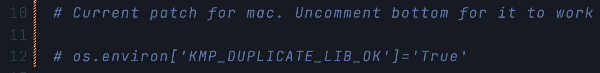

# Indoor / Outdoor Image Classifier - Web App

## Description:

This is an image classifier web app, which takes in an image, gets processed through a depth-prediction neural network. Then it tells the user whether the inputted image is an indoor, or outdoor scene. As well as providing the user with the original image, its depth maps, as well as a plotted graph of the depth distribution.

---

## Technology used

- Flask
  - Python web framework used to build the application front and back end
- Omnidata
  - Neural Network which extrapolates the depth information of a given image.
    - Reference: https://github.com/EPFL-VILAB/omnidata/tree/main/omnidata_tools/torch
  
---

### Pre-requesites:

- Download pre trained models from google drive
- Place models into **"image-classifier/omnidata/pretrained_models"** folder

  - **_Note: the models have to be downloaded from a drive due to GitHub's file restriction_**
    - Not pushing those files is handled by gitignore

- Fogsphere has a conda environment with the required packages installed. This env can be activated with: `conda activate flask-app`

For any other situation, it is recommended to create a conda environment, and then install the packages in it.

Once the environment has been activated, we can install them by running

    pip install -r packages.txt

---

The link for the google drive with the pre trained models can be found [Here](https://drive.google.com/uc?id=1Jrh-bRnJEjyMCS7f-WsaFlccfPjJPPHIS)

** Note ** For mac users, it might be required to uncomment
 `os.environ['KMP_DUPLICATE_LIB_OK']='True' ` 
 
This will allow the app to run properly. Located in main.py

